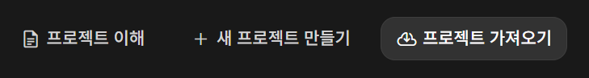

# CCFEPub
## Custom Chatbot For Education
- LLM, 챗봇 교육을 위한 프로젝트
- 간단한 명령어로 챗봇 페르소나 설정
- GEMINI API 사용

## 사용 방법

1. [Google AI Studio](https://ai.google.dev/aistudio)에 접속합니다.
2. "Get your API key"를 클릭하고 로그인합니다.

   

3. 로그인 후, 왼쪽 메뉴에서 **Dashboard** > **Projects**를 클릭하여 프로젝트 페이지로 이동합니다.

   
   

4. **새 프로젝트 만들기** 버튼을 클릭하여 새로운 프로젝트를 생성합니다.

   

5. **API Keys**를 클릭하여 API 키 관리 페이지로 이동합니다.

   

6. **API 키 만들기**를 클릭하여 새로운 API 키를 생성합니다. 생성 시, 이전에 만든 프로젝트를 선택합니다.

   

7. 생성된 API 키의 **키 부분**을 클릭하고, 키를 복사합니다.

   

8. [CCFEPub](https://maruson08.github.io/CCFEPub/)에 접속하여, 처음 화면에 복사한 API 키를 붙여넣고 사용을 시작합니다.

   

## Planned Features

- 영어 버전 개발  
  **ETA**: TBD

- 실제 챗봇 구조를 설계할 수 있는 명령어 추가 개발  
  **ETA**: TBD

- GUI 개발을 통해 사용자와의 상호작용을 가능하게 만들기  
  **ETA**: TBD

## Contributing

This project is **open source**, and we welcome contributions! Whether you're fixing bugs, adding new features, or improving documentation, feel free to contribute by following these steps:

### How to Contribute

1. **Fork the repository**  
   - Click the "Fork" button at the top-right of the repository page to create a copy of this repository under your own GitHub account.

2. **Clone the repository**  
   - Clone your forked repository to your local machine:
     ```bash
     git clone https://github.com/maruson08/CCFEPub
     ```

3. **Create a new branch**  
   - It's a good practice to create a new branch for your changes:
     ```bash
     git checkout -b feature-name
     ```

4. **Make your changes**  
   - Work on your changes in the new branch. Be sure to test thoroughly before submitting.

5. **Commit your changes**  
   - Once you're happy with your changes, commit them with a meaningful message:
     ```bash
     git commit -m "Add feature or fix bug"
     ```

6. **Push your changes**  
   - Push your changes to your forked repository:
     ```bash
     git push origin feature-name
     ```

7. **Submit a Pull Request**  
   - Go to the repository on GitHub and click "New Pull Request."
   - Compare your changes with the `main` branch and submit the pull request (PR).
   - Provide a detailed description of your changes and any additional context for reviewers.


## License

This project is licensed under the **MIT License**. See the [LICENSE](LICENSE) file for more details.
